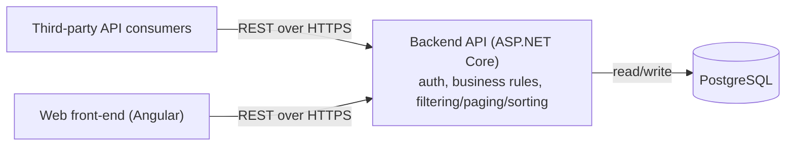
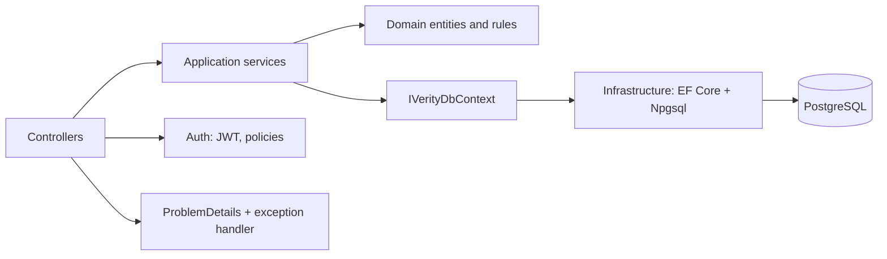

# Architecture

## Component diagram



The web client and any third-party integrator talk to the exact same documented, versioned REST API (`/api/v1`) — there is no back-channel between the browser and the database.

## Backend: layered architecture



Four projects, dependencies pointing inward:

- **Verity.Domain** — plain entities (`User`, `Post`, `Comment`, `Like`, `PostTagAssignment`) with private setters and factory methods, `DomainException`/`DomainErrorCode`. No EF, no ASP.NET, no third-party references at all.
- **Verity.Application** — services (`AuthService`, `PostService`, `CommentService`, `LikeService`, `TagService`), DTOs, query objects, and the abstractions the services depend on (`IVerityDbContext`, `IPasswordHasher`, `ITokenService`, `ICurrentUser`, `IClock`).
- **Verity.Infrastructure** — `VerityDbContext` and its `IEntityTypeConfiguration<T>` classes, the EF Core migration, the JWT/password-hashing implementations, and the database seeder.
- **Verity.Api** — controllers, `Program.cs` composition root, the global exception handler.

No MediatR, no generic repository, no AutoMapper — services take `IVerityDbContext` directly (an interface over the real `DbContext` exposing `DbSet`s and `SaveChangesAsync`), so the query shape stays visible in one place and services stay unit-testable without a database.

## Frontend: feature structure

```
src/app/
├─ core/          # singletons: ApiClient + DTO models, AuthStore + interceptors + guards, ProblemDetails mapping
├─ shared/        # dumb UI primitives (spinner, alert, pagination, empty-state, tag-badge) and form helpers
├─ features/
│  ├─ posts/      # PostsStore, post-list, post-detail, post-create
│  └─ auth/       # login, register
├─ layout/        # AppShell: header/nav driven by AuthStore
└─ app.routes.ts, app.config.ts
```

Standalone components throughout, signals for state (`AuthStore`, `PostsStore`, and local component signals for post-detail's own state), `OnPush` change detection everywhere, lazy-loaded feature routes.

## Decisions

| Concern | Decision | Why |
|---|---|---|
| Datastore | PostgreSQL 17 via Docker Compose, EF Core 10 + Npgsql | The data is strongly relational (users/posts/comments/likes/tags with FK integrity); a unique constraint enforces one-like-per-user at the database, not just in application code; Postgres is free and self-hostable, matching the "own it end-to-end" goal. |
| Runtime | .NET 10, ASP.NET Core with controllers | Current LTS; controllers + attribute routing integrate cleanly with API versioning, OpenAPI and ProblemDetails. |
| Auth | In-app username/password, `PasswordHasher<T>` (PBKDF2) for hashing, stateless HS256 JWT for sessions | Satisfies "handle auth in the application itself." The full ASP.NET Identity framework was skipped — its user store, cookie schemes and UI scaffolding aren't justified by this timebox; the hasher alone gives vetted crypto without reinventing it. |
| API versioning | `Asp.Versioning.Mvc`, URL-segment (`/api/v1/...`) | Most discoverable for third-party consumers; works directly in a browser or Postman without custom headers. |
| Frontend framework | Angular 21, standalone + signals, zoneless | Matches the assessment's preferred stack. Signals + a couple of store services give clear state management without NgRx ceremony, which isn't justified at this scale. |
| Frontend state | Signals-based stores (`AuthStore`, `PostsStore`) + local component signals for post-detail | Post-detail's own state (post, comments, pending flags) doesn't need to survive navigation away, so it stays local rather than polluting a global store. |
| Paging | Offset (page/pageSize) | The assessment specifies page/pageSize directly, and the dataset is small; keyset paging is the noted production upgrade for a much larger forum. |
| Like count | Denormalised `like_count` on `posts`, `likes` table remains the source of truth | Makes the required like-count sort indexable. Every write path that changes it (`LikeService`) does so inside a transaction with the underlying `likes` row, so the counter and the source of truth can't drift under normal operation. |

## Query efficiency: evidence, not assertion

The spec requires `GET /posts` to execute at most 2 SQL commands and `GET /posts/{id}` exactly 1, with no N+1. This is asserted by an integration test using a real `DbCommandInterceptor` (`EfficiencyApiTests`, not log-scraping), and was independently confirmed by hand against a live Postgres instance with EF's command logging enabled.

### `GET /posts?pageSize=20` — exactly 2 commands

```sql
SELECT count(*)::int
FROM posts AS p
```

```sql
SELECT p0.id, p0.title, CASE
    WHEN length(p0.body)::int <= 200 THEN p0.body
    ELSE substring(p0.body, 1, 200)
END, u.id, u.username, CASE u.role
    WHEN 0 THEN 'User'
    WHEN 1 THEN 'Moderator'
    ELSE u.role::text
END, p0.created_at, p0.like_count, (
    SELECT count(*)::int
    FROM comments AS c
    WHERE p0.id = c.post_id), s.c, s.id, s.username, s.c0, s.reason, s.created_at, s.post_id, s.tag
FROM (
    SELECT p.id, p.author_id, p.body, p.created_at, p.like_count, p.title
    FROM posts AS p
    ORDER BY p.created_at DESC, p.id DESC
    LIMIT @p1 OFFSET @p
) AS p0
INNER JOIN users AS u ON p0.author_id = u.id
LEFT JOIN (
    SELECT CASE p1.tag
        WHEN 1 THEN 'MisleadingOrFalse'
        ELSE p1.tag::text
    END AS c, u0.id, u0.username, CASE u0.role
        WHEN 0 THEN 'User'
        WHEN 1 THEN 'Moderator'
        ELSE u0.role::text
    END AS c0, p1.reason, p1.created_at, p1.post_id, p1.tag
    FROM post_tags AS p1
    INNER JOIN users AS u0 ON p1.tagged_by_user_id = u0.id
) AS s ON p0.id = s.post_id
ORDER BY p0.created_at DESC, p0.id DESC, u.id, s.post_id, s.tag
```

The comment count is a correlated scalar subquery (folded into the same round trip), and tags are pulled in via a single `LEFT JOIN` against a subquery — not a per-row lookup. `EXPLAIN` on the like-count sort variant of this query confirms Postgres uses `ix_posts_like_count` for the ordering rather than a sequential scan.

### `GET /posts/{id}` — exactly 1 command

```sql
SELECT s.id, s.title, s.body, s.id0, s.username, s.c, s.created_at, s.like_count, s.c0, s0.c, s0.id, s0.username, s0.c0, s0.reason, s0.created_at, s0.post_id, s0.tag
FROM (
    SELECT p.id, p.title, p.body, u.id AS id0, u.username, CASE u.role
        WHEN 0 THEN 'User'
        WHEN 1 THEN 'Moderator'
        ELSE u.role::text
    END AS c, p.created_at, p.like_count, (
        SELECT count(*)::int
        FROM comments AS c
        WHERE p.id = c.post_id) AS c0
    FROM posts AS p
    INNER JOIN users AS u ON p.author_id = u.id
    WHERE p.id = @postId
    LIMIT 1
) AS s
LEFT JOIN (
    SELECT CASE p0.tag
        WHEN 1 THEN 'MisleadingOrFalse'
        ELSE p0.tag::text
    END AS c, u0.id, u0.username, CASE u0.role
        WHEN 0 THEN 'User'
        WHEN 1 THEN 'Moderator'
        ELSE u0.role::text
    END AS c0, p0.reason, p0.created_at, p0.post_id, p0.tag
    FROM post_tags AS p0
    INNER JOIN users AS u0 ON p0.tagged_by_user_id = u0.id
) AS s0 ON s.id = s0.post_id
ORDER BY s.id, s.id0, s0.post_id, s0.tag
```

## The like transaction

`LikeService.LikeAsync` inserts the `Like` row and bumps `posts.like_count` inside one transaction (`IVerityDbContext.ExecuteInTransactionAsync`, routed through EF Core's configured execution strategy — `EnableRetryOnFailure()` requires user-managed transactions to go through the strategy rather than a plain `Database.BeginTransactionAsync`, which is a real thing that broke on the first attempt and is covered by `LikesApiTests.Concurrent_double_like_yields_exactly_one_row_and_count_one`). A duplicate like hits the `(post_id, user_id)` composite primary key before the counter update ever runs, the transaction rolls back, and the global exception handler maps the resulting `DbUpdateException`/`PostgresException` (SQLSTATE 23505) to `409 already-liked`.

## Versioning evolution

Adding `v2` means a new set of controllers under `api/v2/...` with `[ApiVersion("2.0")]`, living alongside the existing `v1` controllers — the URL-segment scheme means both can be served from the same process indefinitely. A field or endpoint being removed in `v2` would first get a `Deprecation`/`Sunset` response header on the `v1` route for a announced period before removal, per the usual REST deprecation convention; nothing about the current routing needs to change to support that.
